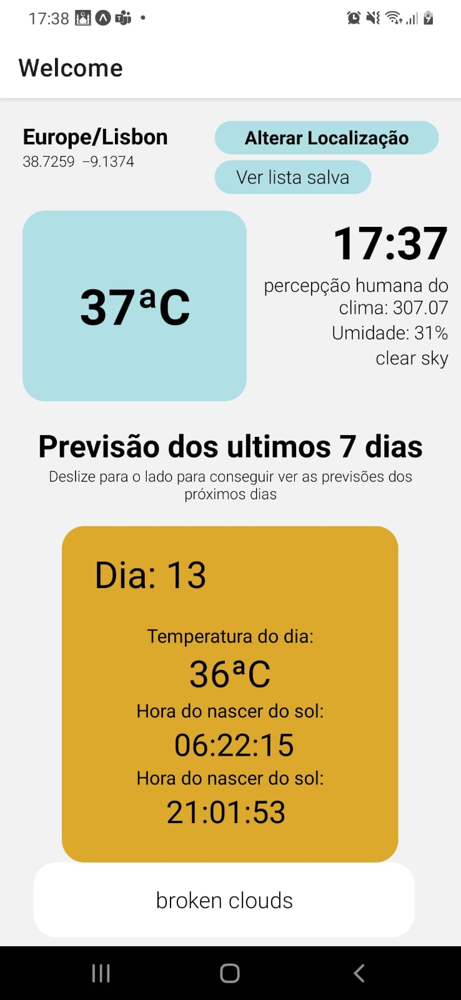
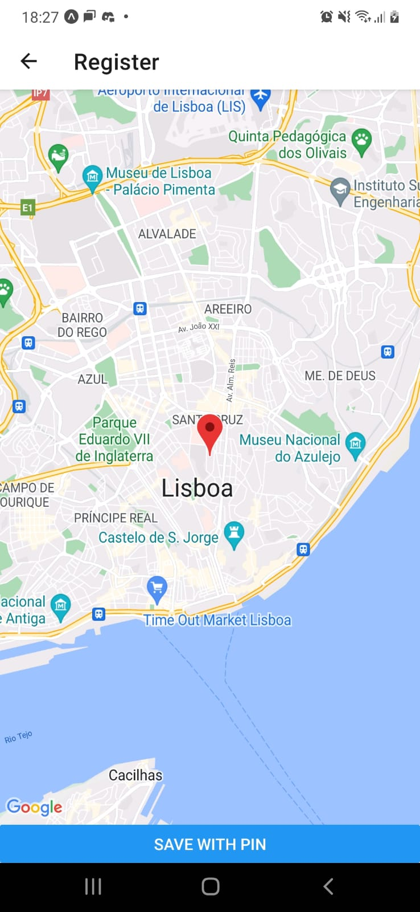

## Project setup
- Create a file `.env` in the main directory with the line 
```
APIKEY=<your OpenWeather API KEY>
```
- The project can be run using in device 
```
yarn 
yarn start
```
- build of android
```
expo build:android
```

[Documentation the API](https://openweathermap.org/appid)

## Project




## technology and libraries used

[Documentation the API](https://openweathermap.org/appid)
[React Native](https://reactnative.dev/)
[Redux](https://redux.js.org/introduction/getting-started)
[react-native-maps](https://www.npmjs.com/package/react-native-maps)
